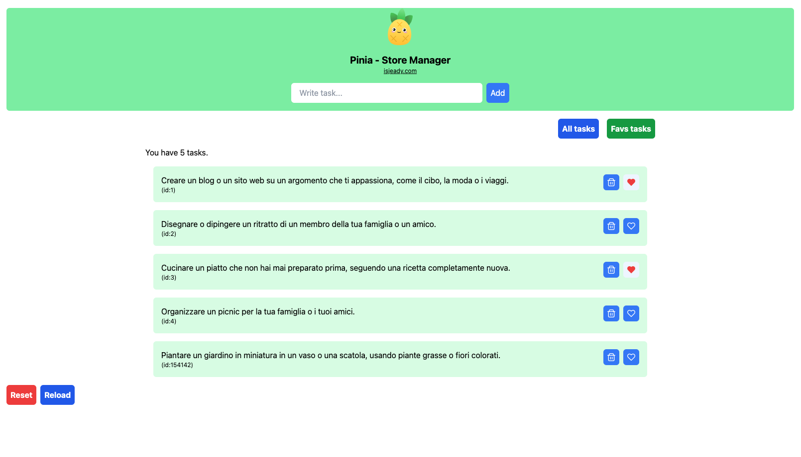

Pinia Tasks Manager



## Project Setup

```sh
npm install
```

### Compile and Hot-Reload for Development

```sh
npm run dev
```

### Backend - Install Json Server

```
npm install -g json-server
```

```sh
json-server --watch ./data/db.json --port 3001  
```
